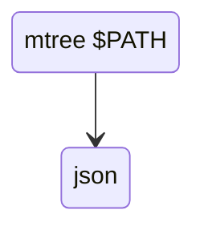

# Haskell >= mtree

## GHC Version

GHC version must be aligned with the .cabal file's 

-  build-depends: base >= x.x.x 

Use `ghcup tui` -> i(install) -> s(et)

```mermaid
stateDiagram-v2
    s1 : mtree $PATH
    s1 --> json 
```
